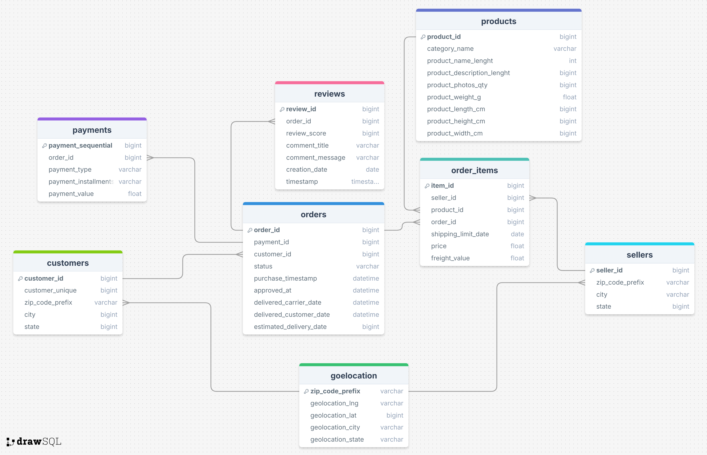
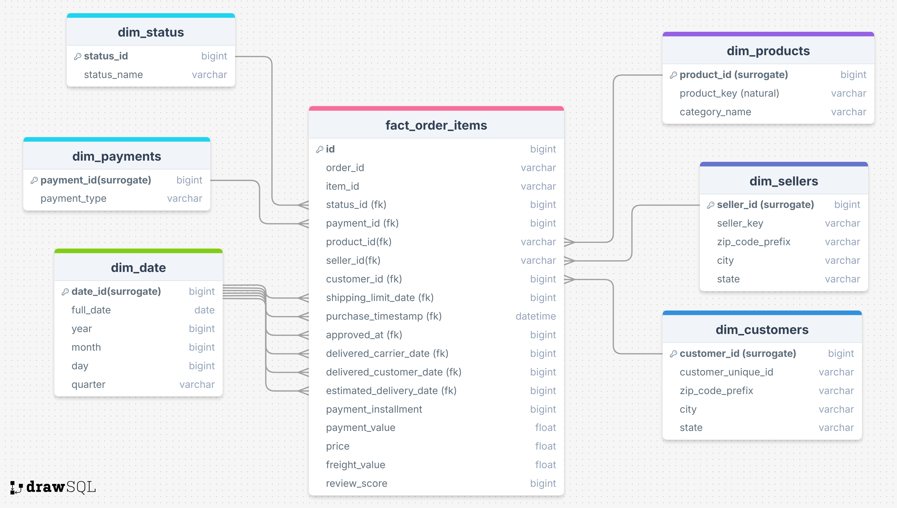
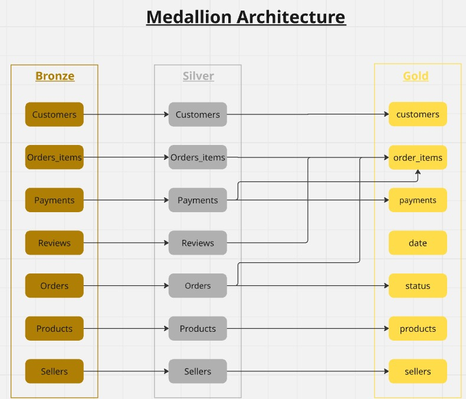
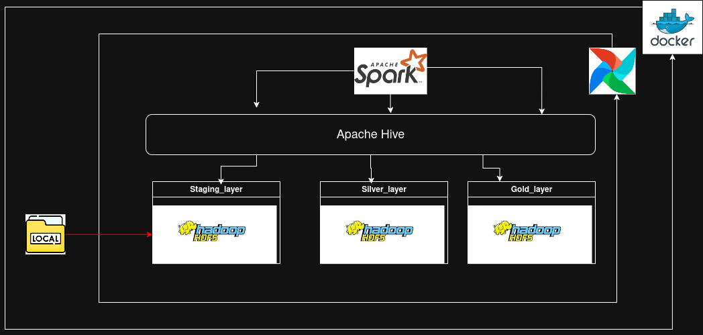
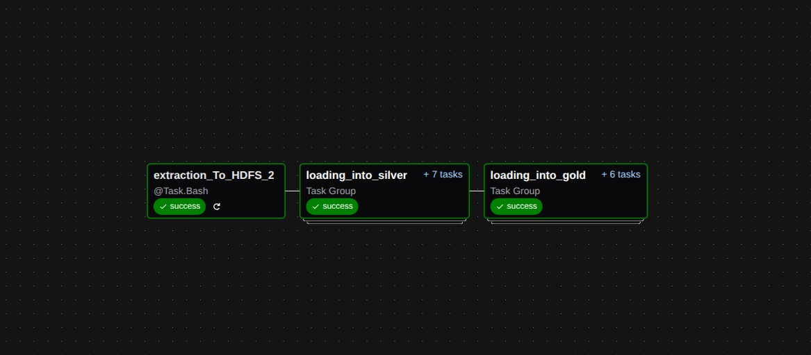
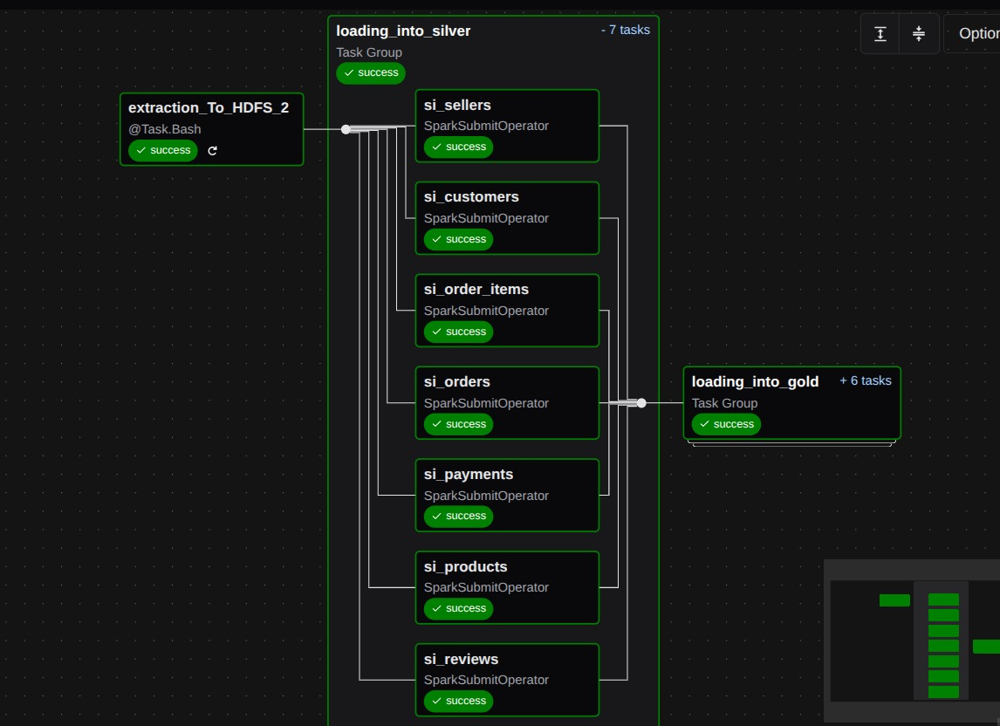
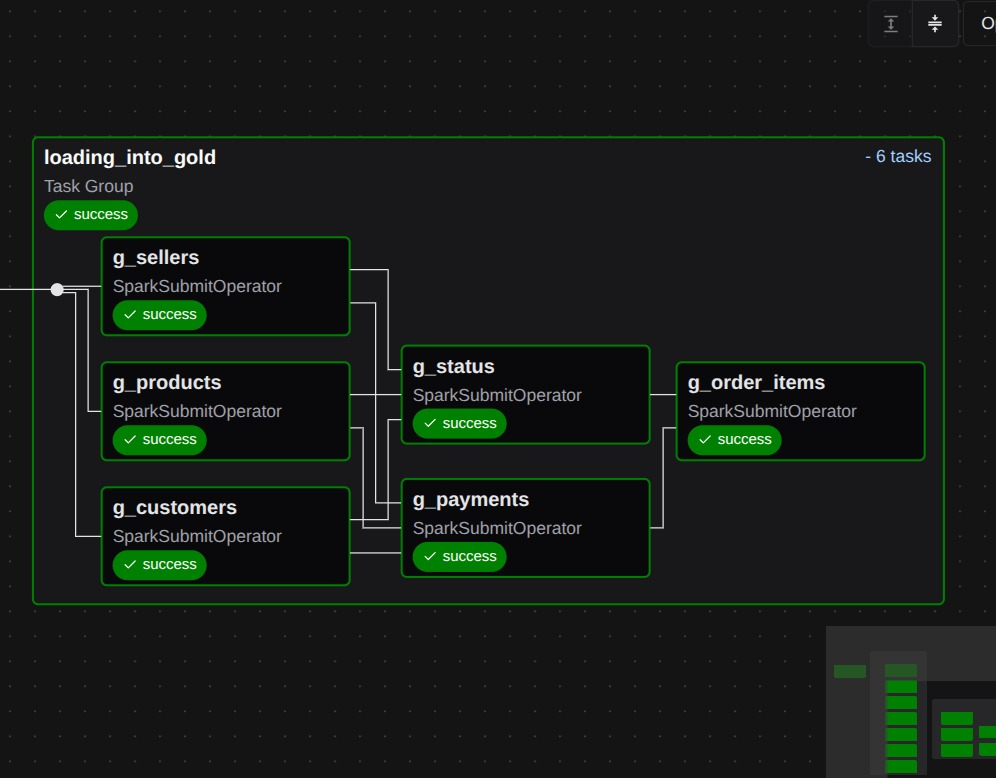
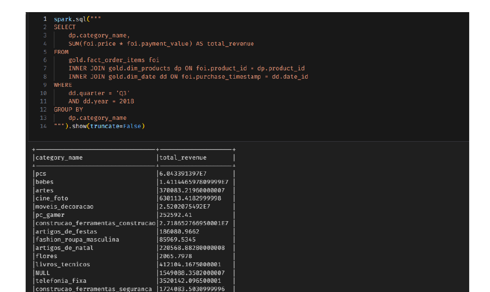
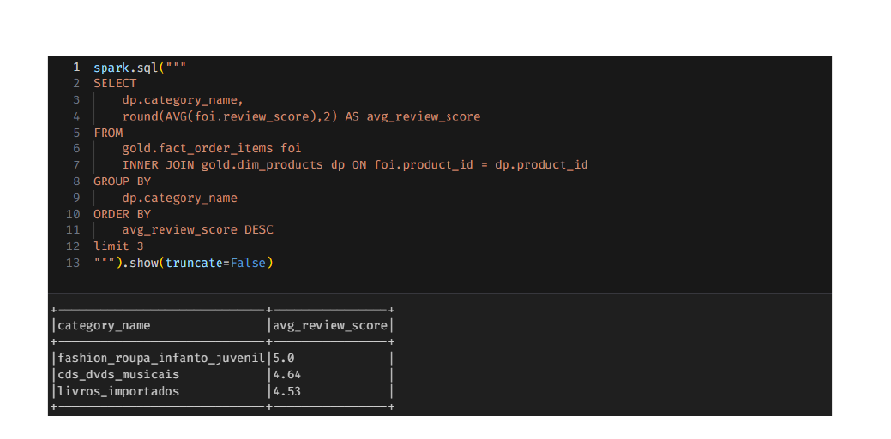
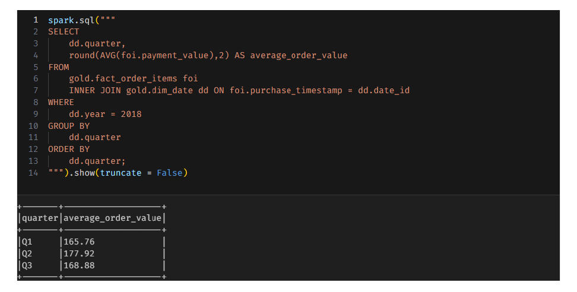

# 
**Project Overview**

- **This project analyzes the Brazilian E-Commerce Public Dataset by Olist, which contains over 100,000 orders placed between 2016 and 2018 across multiple marketplaces in Brazil. The dataset offers a comprehensive view of the e-commerce ecosystem — from order placement to delivery and customer satisfaction.
The main goal of this project is to explore, clean, and analyze the data to uncover meaningful business insights and performance indicators, such as delivery efficiency, payment behavior, product trends, and customer feedback.**
_______
## 
**Dataset Description**

  - **The dataset includes several interconnected tables, allowing multi-dimensional analysis:**
  - Orders: Order status, purchase timestamp, approved time, and delivery performance.
  - Payments: Payment type, installments, and payment values.
  - Logistics: Freight cost and delivery times to customer locations.
  - Products: Product categories, dimensions, and attributes.
  - Customers: Customer city and state information.
  - Reviews: Customer feedback and satisfaction scores.
______
## 
**ERD of e-commerce**

  - 
________
### How to guide stakeholders with some questions as data model ?
 - **Star schema deformalizes source data into facts and dimensions, reducing**
  **complex relationships from ERD models.**
  **It minimizes joins compared to highly normalized OLTP schemas, improving**
  **query speed.**
  **Dimensions hold descriptive attributes, making queries simpler and more**
  **intuitive for analysts.**
  **Aggregations on fact tables become faster and more efficient due to fewer**
  **joins.**
  **It is the standard design for OLAP, BI, and reporting, unlike ERD which is**
  **optimized for.**
________
## 
**Star Schema to answer business questions!!**

  - 
________
## 
**The arechtiecture we had followed is Medallion Architecture**

  - 
_________
## 
**The Data Platform Used in This Project**

  - 
_________
## 
**My Steps to Build the Data Pipeline from Source to Destination**

  -  ### The data pipeline is designed for full data loads (not incremental)
  - ### Data Ingestion
    - **Airflow tasks that load data into HDFS**
    - **Airflow can Handle Errors by retrying Mechanism**

- ###  Data Processing and Transformation using spark
  - **Checking for Duplications.**
  - **Checking for Null values.**
  - **Checking for Consistency.**
  - **Dropping Undefined Data.**
  - **Checking for Negative Values.**
  - **Handling invalid Relationships.**
  - **Handling invalid Data.**
- ### Using Hive as data warehouse
  - **code of silver layer** >>
  - **code of gold layer, specially I mean star schema** >>
- ### Using Airflow as the orchestrator
  - 
  - 
  - 
---------
- ### The following questions were received from the business
  - **What is your total order intake in each product category across**
    **the three Quarter of 2018?**
  - 
  ---------
- ### Which are the 3 categories with the highest score in reviews?
  - 
  ---------
- ### What is the average order volume per quarter in 2018?
  - 
-----------
- ### In the final the tools and technologies were applied:
  - **Ingestion: Airflow tasks that load data into HDFS.**
  - **Storage: Hadoop Distributed File System (HDFS) for the data lake.**
  - **Processing: PySpark for data transformation (ETL jobs).**
  - **Warehousing: Apache Hive external tables.**
  - **Data Modeling: Star schema with Fact and Dimension tables.**
  - **Orchestration: Apache Airflow for customizing Workflow.**
